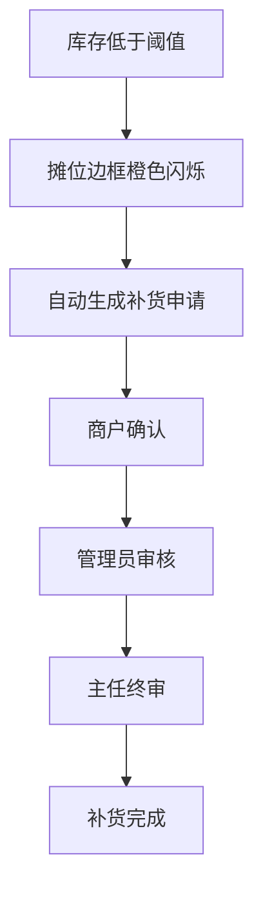
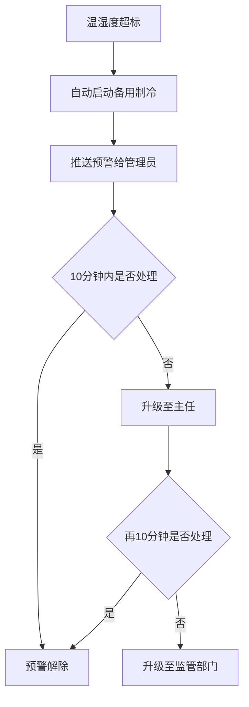
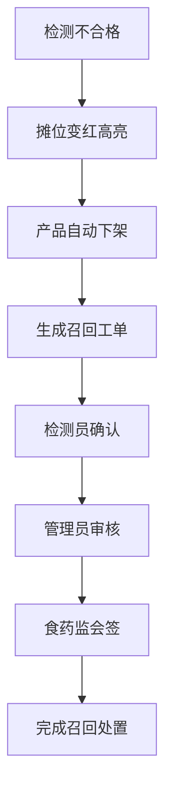
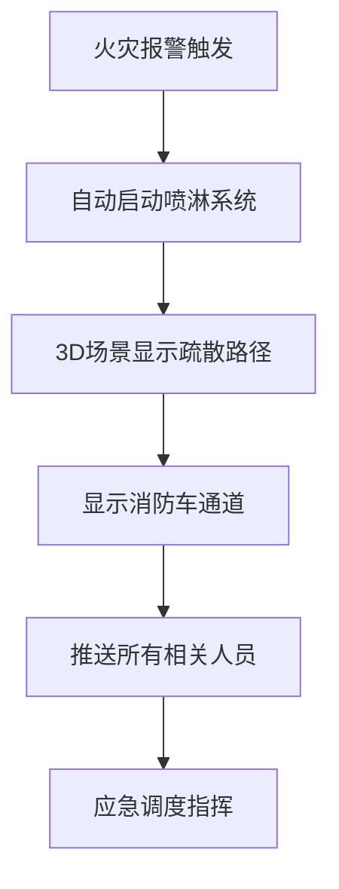

## 1. 产品概述

3D智慧农贸市场综合运营与应急调度可视化平台，通过三维可视化技术实现农贸市场全场景数字化管理，涵盖摊位运营、冷库监控、农产品检测、停车管理、消防应急等核心业务模块，为市场管理者提供实时监控、智能预警、应急调度的一体化决策支持平台。

- **核心目标**：解决传统农贸市场管理手段落后、应急响应慢、数据分散的问题，实现市场运营的数字化、智能化、可视化
- **目标用户**：市场商户、市场管理员、市场主任、食药监/监管部门
- **核心价值**：提升运营效率、降低安全风险、保障食品安全、优化客流管理

## 2. 核心功能

### 2.1 用户角色与权限

| 角色 | 登录方式 | 核心权限 |
|------|----------|----------|
| 商户 | 人脸识别 | 查看自有摊位数据、库存管理、补货申请、查看审批状态 |
| 管理员 | 人脸识别 | 摊位管理、审批补货申请、冷库监控、停车管理、日报导出 |
| 主任 | 人脸识别 | 全场景监控、三级审批终审、应急调度指挥、全局数据统计 |
| 监管（食药监） | 人脸识别 | 检测数据查看、不合格品处置会签、食品安全监管、应急事件督办 |

### 2.2 功能模块

1. **3D可视化场景**：摊位、冷库、检测中心、停车场、监控中心五大区域三维建模与实时数据展示
2. **摊位运营管理**：商户信息展示、实时库存监控、客流热度热力图、库存预警与补货申请审批流程
3. **冷库监控系统**：温湿度实时监测、超标自动预警、备用制冷自动启动、预警升级机制
4. **农产品检测中心**：检测数据实时展示、不合格品自动下架、召回工单生成、三级会签流程
5. **客流预测与热力分区**：基于气象和节假日数据的客流预测、3D热力分区展示、区域开闭建议
6. **智能停车管理**：车位实时状态显示、剩余车位不足10%自动引导备用区、停车路径规划
7. **消防应急联动**：火灾自动预警、喷淋系统自动启动、疏散路径动态规划、消防车通道引导
8. **日报数据导出**：销售额统计、检测不合格率、应急事件统计、Excel报表导出

### 2.3 页面详情

| 页面名称 | 模块名称 | 功能描述 |
|----------|----------|----------|
| 登录页 | 人脸识别登录 | 摄像头人脸识别、角色选择、身份验证 |
| 3D主场景 | 市场全景 | 3D市场场景漫游、五大区域展示、实时数据悬浮层 |
| 3D主场景 | 摊位管理 | 摊位信息面板、库存状态、客流热度、补货申请入口 |
| 3D主场景 | 冷库监控 | 温湿度曲线、超标预警、设备状态、应急控制 |
| 3D主场景 | 检测中心 | 检测结果展示、不合格品列表、召回工单管理 |
| 3D主场景 | 停车场 | 车位热力图、剩余车位、备用区引导、路径规划 |
| 3D主场景 | 监控中心 | 视频监控墙、报警汇总、应急调度台 |
| 审批面板 | 补货审批 | 补货申请列表、商户→管理员→主任三级审批流程 |
| 审批面板 | 检测会签 | 不合格品处置、检测员→管理员→食药监三级会签 |
| 数据中心 | 统计报表 | 销售额、客流、检测合格率、应急事件统计图表 |
| 数据中心 | 日报导出 | 日报数据预览、Excel格式下载导出 |

## 3. 核心流程

### 3.1 库存预警与补货审批流程

当摊位库存低于安全阈值时，系统自动触发橙色边框闪烁预警并生成补货申请，经过商户确认→管理员审核→主任终审三级审批流程后完成补货。

### 3.2 冷库温湿度超标预警流程

温湿度超标时自动启动备用制冷设备，推送预警信息，超时未处理自动升级预警级别。

### 3.3 不合格品处置流程

检测不合格时摊位变红，产品自动下架，生成召回工单，需三级会签。

### 3.4 消防应急联动流程

## 4. 用户界面设计

### 4.1 设计风格

- **主色调**：深蓝科技感底色（#0A1628）、青绿色数据强调（#00E5FF）、橙色预警（#FF8C00）、红色警报（#FF3D57）、绿色正常（#00C48C）
- **3D场景风格**：赛博朋克+工业科技风，暗色系环境配合霓虹光效，全息投影式数据面板
- **按钮样式**：扁平化科技感按钮，带发光边框，悬停时有光效扩散动画
- **字体**：标题使用"Orbitron"科技感字体，正文使用"Microsoft YaHei"清晰易读
- **布局风格**：3D场景占中央主区域，四周环绕悬浮式数据面板，顶部状态栏+底部控制栏
- **图标风格**：Lucide线性图标，配合发光效果

### 4.2 页面设计概述

| 页面名称 | 模块名称 | UI元素与设计 |
|----------|----------|--------------|
| 登录页 | 人脸识别 | 居中圆形扫描框、动态扫描线、粒子背景、角色选择卡片 |
| 3D主场景 | 市场全景 | 暗色3D市场模型、数据悬浮标签、粒子光效、后期泛光 |
| 3D主场景 | 数据面板 | 半透明毛玻璃面板、霓虹边框、实时数据滚动、图表发光效果 |
| 审批面板 | 审批卡片 | 列表卡片布局、状态标签、审批进度条、操作按钮组 |
| 数据中心 | 统计图表 | ECharts科技感图表、渐变色、动画加载、数据钻取 |

### 4.3 响应式设计

- 桌面端优先设计（1920×1080及以上）
- 3D场景自适应缩放，数据面板响应式重排
- 支持1366×768最低分辨率
- 触控设备支持3D场景手势旋转缩放

### 4.4 3D场景设计

- **环境与氛围**：暗室环境，HDRI营造室内灯光效果，体积雾增强空间感
- **灯光设置**：区域型点光源模拟市场照明，摊位区域彩色LED灯效，预警时红色闪烁光源
- **摄像机设置**：默认俯视45°角全景，支持轨道控制器旋转缩放，一键切换区域视角
- **构图与焦点**：中心主场景+四周数据面板布局，预警时自动聚焦到问题区域
- **交互与动画**：点击摊位弹出详情面板，客流粒子流动效果，预警区域脉冲动画，消防时路径发光流动
- **后期效果**：Bloom泛光、SSAO环境光遮蔽、色调映射、轻微颗粒感
- **性能预算**：3D模型面数控制在5万以内，Draw Call < 100，稳定60FPS
