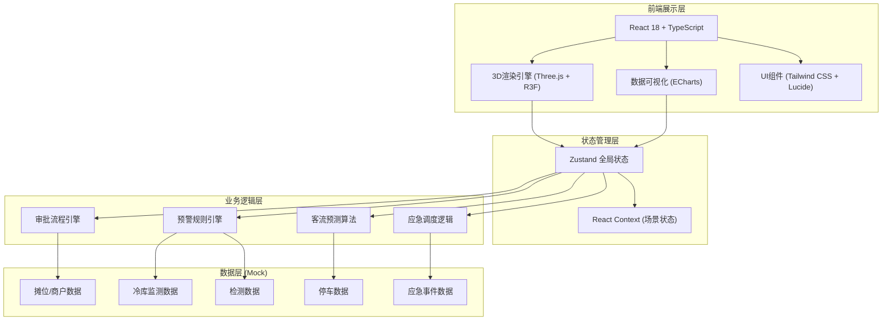

## 1. 架构设计



## 2. 技术选型说明

| 层级 | 技术栈 | 版本说明 |
|------|--------|----------|
| 前端框架 | React@18 + TypeScript@5 | 函数式组件 + Hooks |
| 构建工具 | Vite@5 | 快速冷启动与HMR |
| 3D渲染 | three@0.160 + @react-three/fiber@8 + @react-three/drei@9 + @react-three/postprocessing@2 | 声明式Three.js开发 |
| 状态管理 | zustand@4 | 轻量级状态管理 |
| 样式方案 | tailwindcss@3 + postcss@8 | 原子化CSS |
| 图表可视化 | echarts@5 + echarts-for-react@3 | 丰富图表类型 |
| 路由 | react-router-dom@6 | 声明式路由 |
| 图标 | lucide-react@0.294 | 线性图标库 |
| Excel导出 | xlsx@0.18 | Excel文件生成 |
| 后端 | Express@4（可选，用于模拟API） | 本次使用纯前端Mock数据 |

## 3. 路由定义

| 路由路径 | 页面组件 | 功能说明 |
|----------|----------|----------|
| `/login` | `LoginPage` | 人脸识别登录页 |
| `/dashboard` | `DashboardPage` | 3D主场景+数据面板 |
| `/approvals` | `ApprovalsPage` | 补货审批与检测会签 |
| `/reports` | `ReportsPage` | 数据统计与日报导出 |

## 4. 数据模型（TypeScript 类型定义）

### 4.1 核心实体类型

```typescript
// 用户角色
type UserRole = 'merchant' | 'admin' | 'director' | 'supervisor';

// 用户信息
interface User {
  id: string;
  name: string;
  role: UserRole;
  avatar?: string;
  permissions: string[];
}

// 摊位信息
interface Stall {
  id: string;
  name: string;
  merchantName: string;
  merchantId: string;
  category: 'vegetable' | 'meat' | 'seafood' | 'fruit' | 'grain';
  position: { x: number; y: number; z: number };
  inventory: number;
  safeInventoryThreshold: number;
  passengerHeat: number; // 0-100
  salesToday: number;
  status: 'normal' | 'lowStock' | 'unqualified' | 'closed';
}

// 冷库信息
interface ColdStorage {
  id: string;
  name: string;
  temperature: number;
  humidity: number;
  tempThreshold: { min: number; max: number };
  humidityThreshold: { min: number; max: number };
  mainCoolingStatus: 'running' | 'stopped' | 'fault';
  backupCoolingStatus: 'running' | 'stopped' | 'standby';
  status: 'normal' | 'warning' | 'critical';
  warningDuration: number;
}

// 农产品检测记录
interface InspectionRecord {
  id: string;
  stallId: string;
  productName: string;
  sampleNo: string;
  inspector: string;
  inspectTime: Date;
  items: { name: string; result: 'pass' | 'fail'; value?: number }[];
  overallResult: 'pass' | 'fail';
  handled: boolean;
}

// 停车位
interface ParkingSpot {
  id: string;
  zone: 'main' | 'backup';
  position: { x: number; y: number; z: number };
  occupied: boolean;
  vehiclePlate?: string;
}

// 补货申请
interface RestockRequest {
  id: string;
  stallId: string;
  productName: string;
  quantity: number;
  createTime: Date;
  status: 'pending_merchant' | 'pending_admin' | 'pending_director' | 'approved' | 'rejected';
  approvalLogs: { approver: string; role: UserRole; comment?: string; time: Date }[];
}

// 召回工单
interface RecallOrder {
  id: string;
  inspectionId: string;
  stallId: string;
  productName: string;
  quantity: number;
  createTime: Date;
  status: 'pending_inspector' | 'pending_admin' | 'pending_supervisor' | 'completed' | 'cancelled';
  signLogs: { signer: string; role: UserRole; comment?: string; time: Date }[];
}

// 预警信息
interface Alert {
  id: string;
  type: 'inventory' | 'coldstorage' | 'inspection' | 'parking' | 'fire';
  level: 'info' | 'warning' | 'critical';
  targetId: string;
  message: string;
  createTime: Date;
  acknowledged: boolean;
  escalated: boolean;
}

// 消防报警
interface FireAlarm {
  id: string;
  zone: string;
  position: { x: number; y: number; z: number };
  triggerTime: Date;
  sprinklerActive: boolean;
  evacuationPaths: { start: { x: number; y: number; z: number }; end: { x: number; y: number; z: number } }[];
  fireLanePath: { x: number; y: number; z: number }[];
}

// 日报数据
interface DailyReport {
  date: string;
  totalSales: number;
  totalPassenger: number;
  inspectionCount: number;
  unqualifiedCount: number;
  unqualifiedRate: number;
  emergencyCount: number;
  alertCount: number;
}
```

### 4.2 Zustand Store 结构

```typescript
interface AppState {
  // 认证
  currentUser: User | null;
  login: (faceData: any) => Promise<boolean>;
  logout: () => void;
  
  // 业务数据
  stalls: Stall[];
  coldStorages: ColdStorage[];
  inspections: InspectionRecord[];
  parkingSpots: ParkingSpot[];
  restockRequests: RestockRequest[];
  recallOrders: RecallOrder[];
  alerts: Alert[];
  fireAlarms: FireAlarm[];
  
  // 3D场景状态
  selectedObjectId: string | null;
  currentView: 'overview' | 'stalls' | 'coldstorage' | 'inspection' | 'parking' | 'monitor';
  heatmapVisible: boolean;
  
  // 操作方法
  approveRestock: (id: string, approver: User) => void;
  signRecall: (id: string, signer: User) => void;
  acknowledgeAlert: (id: string) => void;
  triggerFireAlarm: (zone: string) => void;
  exportDailyReport: (date: string) => Blob;
  simulateDataUpdate: () => void;
}
```

## 5. 目录结构

```
src/
├── components/
│   ├── 3d/
│   │   ├── Scene.tsx              # 3D场景主入口
│   │   ├── MarketStall.tsx        # 摊位模型
│   │   ├── ColdStorageUnit.tsx    # 冷库模型
│   │   ├── InspectionCenter.tsx   # 检测中心模型
│   │   ├── ParkingLot.tsx         # 停车场模型
│   │   ├── MonitorCenter.tsx      # 监控中心模型
│   │   ├── HeatmapOverlay.tsx     # 客流热力层
│   │   ├── FireSystem.tsx         # 消防系统（喷淋/路径）
│   │   └── FloatingLabel.tsx      # 悬浮数据标签
│   ├── ui/
│   │   ├── DataPanel.tsx          # 数据面板
│   │   ├── AlertBanner.tsx        # 预警横幅
│   │   ├── ApprovalCard.tsx       # 审批卡片
│   │   ├── StatCard.tsx           # 统计卡片
│   │   └── GlowButton.tsx         # 发光按钮
│   ├── charts/
│   │   ├── SalesChart.tsx         # 销售图表
│   │   ├── TempHumidityChart.tsx  # 温湿度曲线
│   │   └── PassengerForecast.tsx  # 客流预测
│   └── layout/
│       ├── TopBar.tsx             # 顶部状态栏
│       ├── BottomBar.tsx          # 底部控制栏
│       └── SidePanel.tsx          # 侧边数据面板
├── pages/
│   ├── LoginPage.tsx
│   ├── DashboardPage.tsx
│   ├── ApprovalsPage.tsx
│   └── ReportsPage.tsx
├── store/
│   └── useAppStore.ts
├── data/
│   └── mockData.ts
├── utils/
│   ├── approvalEngine.ts
│   ├── alertEngine.ts
│   ├── exportExcel.ts
│   └── passengerForecast.ts
├── types/
│   └── index.ts
├── App.tsx
├── main.tsx
└── index.css
```

## 6. 核心业务逻辑实现说明

### 6.1 审批流程引擎
- 状态机模式管理审批节点流转
- 根据用户角色校验审批权限
- 自动记录审批日志与时间戳
- 支持审批拒绝与退回

### 6.2 预警规则引擎
- 轮询监测数据，与阈值比较触发预警
- 库存<阈值 → 橙色闪烁 + 补货申请
- 温湿度越界 → 启动备用制冷 + 预警推送
- 预警超时（10分钟）自动升级至上级角色
- 检测不合格 → 摊位变红 + 自动下架 + 召回工单

### 6.3 客流预测算法
- 基于历史数据、气象条件、节假日因子加权计算
- 输出客流热力分区（高/中/低）
- 根据阈值建议增开/关闭区域

### 6.4 消防应急联动
- 触发喷淋系统（3D粒子效果）
- 动态计算疏散路径（基于A*算法简化版）
- 高亮消防车通道
- 全场景红色预警闪烁

### 6.5 Excel导出
- 使用xlsx库组装Workbook
- 包含销售、检测、应急三个Sheet
- 支持按日期筛选导出
